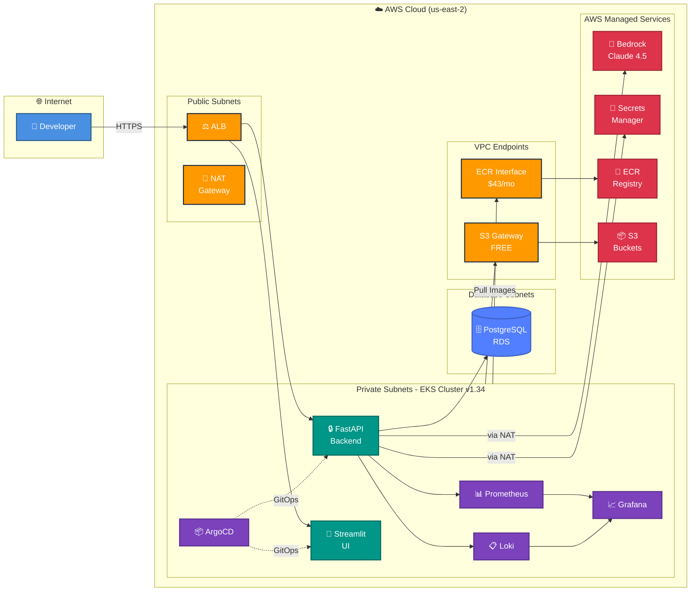
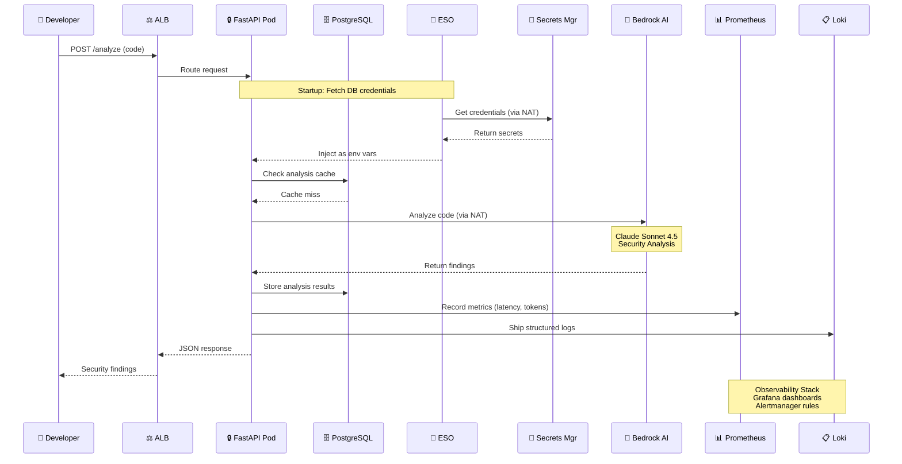

<p align="center">
  
  
  
  
  
</p>

<h1 align="center">🛡️ CodeGuardian AI</h1>

<p align="center">
  <strong>AI-Powered Security Code Reviewer | Production-Grade on AWS EKS</strong>
</p>

<p align="center">
  <em>Catch vulnerabilities before deployment with real-time, context-aware security analysis powered by AWS Bedrock Claude</em>
</p>

---

## 🎯 What Is This?

**CodeGuardian AI** is a **production-grade AI security platform** deployed on AWS EKS. Developers submit code (Python, JavaScript, Terraform), and the system returns real-time security findings with:

- ⚠️ **Severity Ratings** (Critical → Info)
- 📍 **Exact Line Numbers**  
- 🔧 **Fix Suggestions** with code examples
- 📚 **CWE/OWASP Mappings** for compliance

---

## 💡 Why I Built This

Most AI demos stop at "call an API and display the result." This project proves I can take an AI capability and deploy it as a **production-ready platform service** — with the same infrastructure, security, and observability standards I'd use at work.

Every component reflects a deliberate engineering decision:
- **Why EKS over Lambda?** Real workloads need persistent connections, autoscaling control, and sidecar observability — not cold starts.
- **Why ArgoCD over kubectl apply?** GitOps ensures every deployment is auditable, reproducible, and rollback-ready.
- **Why 6 layers of security?** Defense in depth isn't optional when you're processing untrusted code input through an LLM.
- **Why Terraform modules?** The same infrastructure patterns I use at enterprise scale (~200 AWS accounts) applied to a focused project.

**This is not a tutorial project. It's a platform I'd deploy at work.**

---

## ✨ Key Features

| Feature | Description |
|---------|-------------|
| 🤖 **AI-Powered Analysis** | Claude Sonnet 4.5 via AWS Bedrock for intelligent vulnerability detection |
| 🏗️ **Infrastructure as Code** | 100% Terraform-managed AWS infrastructure with modular design |
| ☸️ **Kubernetes Native** | Deployed on EKS with auto-scaling via Karpenter |
| 🔐 **Zero-Trust Security** | EKS Pod Identity, Network Policies, Pod Security Standards, runtime monitoring |
| 📦 **GitOps Deployment** | ArgoCD for declarative, Git-driven deployments |
| 📊 **Full Observability** | Prometheus + Grafana + Loki + OpenTelemetry stack |
| 🚀 **CI/CD Pipeline** | GitHub Actions → Security scans → ECR → Auto-deploy |

---

## 🏛️ Architecture

### High-Level Infrastructure



### 🔄 Request Flow & Data Path



### 💰 Cost-Optimized VPC Endpoints Strategy

| Service | Access Method | Monthly Cost | Rationale |
|---------|---------------|--------------|-----------|
| **S3** | Gateway Endpoint | **$0** | Free - always include |
| **ECR** | Interface Endpoint | **~$43** | Multi-GB image pulls justify cost |
| **Bedrock** | NAT Gateway | **~$2-10** | API payloads <50KB, infrequent |
| **Secrets Mgr** | NAT Gateway | **<$1** | Fetched once at pod startup |
| **Other AWS APIs** | NAT Gateway | **Included** | Low volume traffic |

> **Total VPC Endpoint Savings:** ~$64/month vs. having endpoints for all services

---

## 🛠️ Technology Stack

### Infrastructure Layer
| Category | Technology | Purpose |
|:---------|:-----------|:--------|
| **IaC** | Terraform | Modular AWS provisioning |
| **Compute** | EKS Auto Mode | Managed Kubernetes with Karpenter |
| **Networking** | VPC + VPC CNI | Isolated network with native NetworkPolicy |
| **Storage** | S3 (encrypted) | Document & state storage |
| **Secrets** | AWS Secrets Manager + ESO | Zero hardcoded credentials |
| **Certificates** | ACM + cert-manager | TLS everywhere |

### Platform Layer (Kubernetes Add-ons)
| Category | Components |
|:---------|:-----------|
| **GitOps** | ArgoCD (App of Apps pattern) |
| **Security** | Kyverno • Falco • Trivy |
| **Observability** | Prometheus • Grafana • Loki • Tempo |
| **Networking** | AWS Load Balancer Controller • VPC CNI |
| **Operations** | Velero • Kubecost |

### Application Layer
| Component | Technology |
|:----------|:-----------|
| **Backend API** | Python 3.13 + FastAPI |
| **Frontend UI** | Streamlit |
| **AI Engine** | AWS Bedrock (Claude Sonnet 4.5) |
| **Logging** | Structlog (JSON format) |
| **Testing** | Pytest + pytest-asyncio |

---

## 🔒 Security Model (Defense in Depth)

This project implements **6 layers of security controls**:

```
┌─────────────────────────────────────────────────────────────────┐
│  🌐 NETWORK         VPC isolation • Security Groups            │
│                     VPC CNI Network Policies • Private subnets │
├─────────────────────────────────────────────────────────────────┤
│  🔑 IDENTITY        EKS Pod Identity • Least-privilege IAM     │
│                     RBAC • No long-lived credentials           │
├─────────────────────────────────────────────────────────────────┤
│  🔐 DATA            KMS encryption at rest • TLS in transit    │
│                     Secrets Manager • No secrets in code       │
├─────────────────────────────────────────────────────────────────┤
│  🛡️ RUNTIME         Pod Security Standards • Falco monitoring  │
│                     Non-root containers • Read-only filesystems│
├─────────────────────────────────────────────────────────────────┤
│  📦 SUPPLY CHAIN    Trivy scanning in CI • Signed images       │
│                     Kyverno blocking unsigned deployments      │
├─────────────────────────────────────────────────────────────────┤
│  📊 AUDIT           CloudTrail • Centralized logging (Loki)    │
│                     Prometheus alerting • Full traceability    │
└─────────────────────────────────────────────────────────────────┘
```

---

## 📂 Project Structure

```
CodeGuardian-AI/
├── 📁 app/
│   ├── backend/              # FastAPI security analysis service
│   │   ├── src/
│   │   │   ├── api/          # Routes, schemas, endpoints
│   │   │   ├── services/     # Bedrock client, analyzer logic
│   │   │   └── core/         # Config, prompts, settings
│   │   ├── tests/            # Unit & integration tests
│   │   └── Dockerfile        # Multi-stage production build
│   ├── frontend/             # Streamlit UI application
│   └── helm-chart/           # Kubernetes deployment charts
│
├── 📁 terraform/
│   ├── modules/
│   │   ├── networking/       # VPC, subnets, NAT, flow logs
│   │   ├── eks/              # EKS cluster, Pod Identity, Helm addons
│   │   ├── ecr/              # Container registry
│   │   ├── secrets-manager/  # Secrets management
│   │   └── ...               # Additional modules
│   └── environments/         # dev.tfvars, prod.tfvars
│
├── 📁 docs/                  # Architecture & planning docs
├── 📄 docker-compose.yml     # Local development stack
└── 📄 Makefile               # Common automation commands
```

---

## 🚀 Quick Start

### Prerequisites
- AWS Account with Bedrock access (Claude enabled)
- Docker & Docker Compose
- Terraform ≥ 1.0
- kubectl & AWS CLI configured

### Local Development

```bash
# Clone the repository
git clone https://github.com/yourusername/CodeGuardian-AI.git
cd CodeGuardian-AI

# Set up environment variables
cp .env.example .env
# Edit .env with your AWS credentials

# Start the application
docker-compose up

# Access the services
# Backend API:  http://localhost:8000/docs
# Frontend UI:  http://localhost:8501
```

### Deploy to AWS

```bash
# Initialize Terraform
cd terraform
terraform init

# Deploy infrastructure
terraform plan -var-file=environments/dev.tfvars
terraform apply -var-file=environments/dev.tfvars

# Configure kubectl
aws eks update-kubeconfig --name codeguardian-dev

# Verify deployment
kubectl get nodes
kubectl get pods -A
```

---

## 📡 API Reference

### `POST /analyze` — Analyze Code for Vulnerabilities

**Request:**
```json
{
  "code": "user_id = request.args.get('id')\nquery = f'SELECT * FROM users WHERE id = {user_id}'",
  "language": "python",
  "context": "This is a Flask web application"
}
```

**Response:**
```json
{
  "findings": [
    {
      "id": "f1",
      "severity": "CRITICAL",
      "line_start": 2,
      "line_end": 2,
      "vulnerability_type": "SQL Injection",
      "cwe_id": "CWE-89",
      "owasp_category": "A03:2021-Injection",
      "title": "SQL Injection vulnerability detected",
      "description": "User input directly concatenated into SQL query",
      "recommendation": "Use parameterized queries",
      "fix_example": "cursor.execute('SELECT * FROM users WHERE id = ?', (user_id,))"
    }
  ],
  "summary": {
    "total": 1,
    "critical": 1,
    "high": 0,
    "medium": 0,
    "low": 0
  },
  "metadata": {
    "language_detected": "python",
    "lines_analyzed": 2,
    "scan_time_ms": 1250,
    "model_used": "claude-sonnet-4-5"
  }
}
```

### `GET /health` — Health Check
```json
{
  "status": "healthy",
  "version": "0.1.0",
  "bedrock_connected": true
}
```

---

## 📊 Observability Stack

| Component | Tool | Purpose |
|:----------|:-----|:--------|
| **Metrics** | Prometheus + Grafana | Resource utilization, API latency, error rates |
| **Logs** | Loki | Centralized log aggregation with LogQL |
| **Traces** | OpenTelemetry → Tempo | Distributed request tracing |
| **Alerts** | Alertmanager | Incident notification & escalation |
| **Runtime** | Falco | Security event detection |

---

## 🎓 Skills Demonstrated

### ☁️ Cloud & Infrastructure
- **AWS Services:** EKS, Bedrock, VPC, IAM, Secrets Manager, ECR, ALB, S3, KMS
- **Infrastructure as Code:** Terraform with modular design — same patterns used across ~200 production accounts
- **Kubernetes:** Deployments, Services, RBAC, Network Policies, Helm charts, Karpenter autoscaling

### 🤖 AI / LLM Integration
- **Model Integration:** AWS Bedrock (Claude Sonnet 4.5) with structured prompt engineering
- **Prompt Design:** Security-domain system prompts producing structured JSON with CWE/OWASP mappings
- **Production Patterns:** Error handling, retry logic, response validation, token tracking

### 🔐 Security & DevSecOps
- **Zero-Trust Architecture:** EKS Pod Identity, pod-level IAM, no static credentials
- **Policy Enforcement:** Kyverno admission policies, Pod Security Standards
- **Runtime Security:** Falco syscall monitoring for anomaly detection
- **Supply Chain Security:** Trivy container scanning, Checkov IaC scanning, multi-stage CI gates

### 📊 Observability & SRE
- **Metrics:** Prometheus with custom application metrics, Grafana dashboards
- **Logging:** Structured JSON logging (structlog) → Loki with LogQL
- **Tracing:** OpenTelemetry auto-instrumentation → Tempo
- **Alerting:** Alertmanager with escalation rules

### 🚀 CI/CD & GitOps
- **GitOps:** ArgoCD with App of Apps pattern — single source of truth
- **Pipelines:** GitHub Actions with security-first gates (Gitleaks, Semgrep, Snyk, Checkov, Trivy)
- **Container Registry:** ECR with automated vulnerability scanning on push

---

<p align="center">
  <a href="#-what-is-this">Back to Top</a>
</p>
